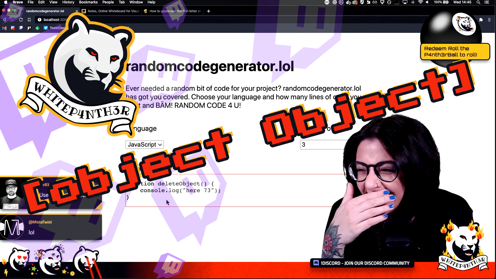

# Welcome to the randomcodegenerator.lol



<!-- ALL-CONTRIBUTORS-BADGE:START - Do not remove or modify this section -->

[](#contributors-)

<!-- ALL-CONTRIBUTORS-BADGE:END -->

Need some code for your project? We've got you covered.

Choose your language. Choose how many lines.

BÄM! You got code.

## Getting Started

First, install dependencies and run the development server:

```bash
npm i
npm run dev
```

Open [http://localhost:3000](http://localhost:3000) with your browser to see the result.

## Adding a new language

The following instructions will guide you through how to add a new language to the generator.

1. Add a new file in tools/utils named {language}.js
2. There are some helper functions available in tools/utils/helpers.js so the first step in your new file is to import those functions:

```js
import {
  getRandomEntry,
  getRandomInt,
  getRandomNounUpperCase,
  getRandomVerbUpperCase,
  getRandomLogLine,
} from "../utils/helpers";
```

It is worth looking at helpers.js in case any of the other functions are applicable to your language, or in case some are in fact not needed at all and don't need to be imported in your file.

3. In your new, create a new JavaScript class with the name of your language

```js
export default class <insert language name here> {

}
```

4. If your language uses functions with access modifers or return types, create a static function for this that returns a string wrapped in ``to define this. See`static getRandomMethodName()` in csharp.js for an example
5. Create a static function called `getRandomFunctionName` or `getRandomMethodName` depending on your language as required which builds up the name using functions from helper.js
6. Create a static function called `getRandomVariableDeclation`, define the common keywords from your language, that returns a random variable declaration using functions from helper.js such as `getRandomEntry(keywords)`. See javascript.js for an example
7. Create a function that will return some random log lines from the helper file. Name this after how your language words output. For example csharp.js has `getRandomDebugWriteLine` and javascript.js has `getRandomConsoleLog`
8. Inside this function, paste the following

```js
const options = getLogLines();
return getRandomEntry(options);
```

9. We now want to create some silly filler lines so create the following function in your file and update it reflect your language syntax and file name

```js
static getRandomFillerLine() {
  const options = [
    `console.log(${JavaScript.getRandomConsoleLog()});`,
    JavaScript.getRandomVariableDeclaration(),
    `${JavaScript.getRandomFunctionName()}();`,
  ];
  return getRandomEntry(options);
}
```

10. Save your file as it is now time to use it
11. Open tools/RandomCodeGenerator.js
12. Import the reference to your language file, following the pattern of the existing code
13. Add your language to the list of languages. The name cannot have special characters but the value as a string is how the language will appear on the buttons so straight text will work such as the existing C++
14. After the last case statement but before default, add the word case followed by your language name in quotes and followed by a colon (: symbol)
15. Assign a string surrounded by ``to`firstLine` that reflects how a method or function is declared in your language
16. Paste the following after your `firstLine` assignment, updating to reflect your language syntax and file name, for example:

```js
for (let i = 1; i <= fillerLineQty; i++) {
  fillerLines.push(`    ${CPlusPlus.getRandomFillerLine()}`);
}

lastLine = "${addNewLine()}}";

return firstLine + fillerLines.join(addNewLine()) + lastLine;
```

17. Open languages.js and add your language to the Languages object
18. Open contributors.js and add your GitHub username to the Contributors object at the top of the file
19. Make sure everything is saved, then take a look at your changes on [http://localhost:3000](http://localhost:3000)

```bash
  npm run dev
```

20. Check the page is displaying correctly and enjoy your hard work :)
21. If it all runs and displays your language correctly, submit a PR to the original repo and celebrate 🎉

## Contributors ✨

Thanks goes to these wonderful people ([emoji key](https://allcontributors.org/docs/en/emoji-key)):

<!-- ALL-CONTRIBUTORS-LIST:START - Do not remove or modify this section -->
<!-- prettier-ignore-start -->
<!-- markdownlint-disable -->
<table>
  <tr>
    <td align="center"><a href="https://isabellabrookes.com"><br /><sub><b>Isabella Brookes</b></sub></a><br /><a href="https://github.com/whitep4nth3r/randomcodegenerator.lol/commits?author=isabellabrookes" title="Code">💻</a></td>
    <td align="center"><a href="https://codyanhorn.tech/"><br /><sub><b>Cody Merritt Anhorn</b></sub></a><br /><a href="https://github.com/whitep4nth3r/randomcodegenerator.lol/commits?author=canhorn" title="Code">💻</a></td>
    <td align="center"><a href="https://github.com/jwalter"><br /><sub><b>jwalter</b></sub></a><br /><a href="https://github.com/whitep4nth3r/randomcodegenerator.lol/commits?author=jwalter" title="Code">💻</a></td>
    <td align="center"><a href="https://github.com/callticketron"><br /><sub><b>ticketron</b></sub></a><br /><a href="https://github.com/whitep4nth3r/randomcodegenerator.lol/commits?author=callticketron" title="Code">💻</a></td>
    <td align="center"><a href="https://www.lucecarter.co.uk"><br /><sub><b>Luce Carter</b></sub></a><br /><a href="https://github.com/whitep4nth3r/randomcodegenerator.lol/commits?author=LuceCarter" title="Code">💻</a> <a href="https://github.com/whitep4nth3r/randomcodegenerator.lol/commits?author=LuceCarter" title="Documentation">📖</a></td>
    <td align="center"><a href="https://twitter.com/lukeocodes"><br /><sub><b>Luke Oliff</b></sub></a><br /><a href="https://github.com/whitep4nth3r/randomcodegenerator.lol/commits?author=lukeocodes" title="Code">💻</a></td>
    <td align="center"><a href="https://www.rickvandenbosch.net"><br /><sub><b>Rick van den Bosch</b></sub></a><br /><a href="https://github.com/whitep4nth3r/randomcodegenerator.lol/commits?author=rickvdbosch" title="Code">💻</a></td>
  </tr>
  <tr>
    <td align="center"><a href="https://github.com/MistaTwist"><br /><sub><b>Paul Perry</b></sub></a><br /><a href="https://github.com/whitep4nth3r/randomcodegenerator.lol/commits?author=MistaTwist" title="Code">💻</a></td>
    <td align="center"><a href="https://deloughry.co.uk"><br /><sub><b>Matthew Peck-Deloughry</b></sub></a><br /><a href="https://github.com/whitep4nth3r/randomcodegenerator.lol/commits?author=DR-DinoMight" title="Code">💻</a></td>
    <td align="center"><a href="http://negue.github.io"><br /><sub><b>negue</b></sub></a><br /><a href="https://github.com/whitep4nth3r/randomcodegenerator.lol/commits?author=negue" title="Code">💻</a></td>
    <td align="center"><a href="http://www.rhyspowell.com"><br /><sub><b>Rhys Powell</b></sub></a><br /><a href="https://github.com/whitep4nth3r/randomcodegenerator.lol/commits?author=rhyspowell" title="Code">💻</a></td>
    <td align="center"><a href="https://madhousesteve.codes"><br /><sub><b>Sociable Steve</b></sub></a><br /><a href="https://github.com/whitep4nth3r/randomcodegenerator.lol/commits?author=SociableSteve" title="Code">💻</a></td>
    <td align="center"><a href="https://sketchni.codes"><br /><sub><b>Denver F</b></sub></a><br /><a href="https://github.com/whitep4nth3r/randomcodegenerator.lol/commits?author=SketchNI" title="Code">💻</a></td>
    <td align="center"><a href="https://github.com/mrange"><br /><sub><b>mrange</b></sub></a><br /><a href="https://github.com/whitep4nth3r/randomcodegenerator.lol/commits?author=mrange" title="Code">💻</a></td>
  </tr>
  <tr>
    <td align="center"><a href="https://github.com/matthewbrandt"><br /><sub><b>matthewbrandt</b></sub></a><br /><a href="https://github.com/whitep4nth3r/randomcodegenerator.lol/commits?author=matthewbrandt" title="Code">💻</a></td>
    <td align="center"><a href="https://github.com/justinhhorner"><br /><sub><b>Justin Horner</b></sub></a><br /><a href="https://github.com/whitep4nth3r/randomcodegenerator.lol/commits?author=justinhhorner" title="Code">💻</a></td>
    <td align="center"><a href="https://github.com/tBoccinfuso"><br /><sub><b>Thomas Boccinfuso</b></sub></a><br /><a href="https://github.com/whitep4nth3r/randomcodegenerator.lol/commits?author=tBoccinfuso" title="Code">💻</a></td>
    <td align="center"><a href="https://github.com/michaud"><br /><sub><b>michaud</b></sub></a><br /><a href="https://github.com/whitep4nth3r/randomcodegenerator.lol/commits?author=michaud" title="Code">💻</a></td>
    <td align="center"><a href="http://elsmore.me"><br /><sub><b>Mike Elsmore</b></sub></a><br /><a href="https://github.com/whitep4nth3r/randomcodegenerator.lol/commits?author=ukmadlz" title="Code">💻</a></td>
    <td align="center"><a href="https://github.com/Refito"><br /><sub><b>Refik Refik Tefik</b></sub></a><br /><a href="https://github.com/whitep4nth3r/randomcodegenerator.lol/commits?author=Refito" title="Code">💻</a></td>
    <td align="center"><a href="https://github.com/Mark-Phillipson"><br /><sub><b>Mark Phillipson</b></sub></a><br /><a href="https://github.com/whitep4nth3r/randomcodegenerator.lol/commits?author=Mark-Phillipson" title="Code">💻</a></td>
  </tr>
</table>

<!-- markdownlint-restore -->
<!-- prettier-ignore-end -->

<!-- ALL-CONTRIBUTORS-LIST:END -->

This project follows the [all-contributors](https://github.com/all-contributors/all-contributors) specification. Contributions of any kind welcome!

This is a [Next.js](https://nextjs.org/) project bootstrapped with [`create-next-app`](https://github.com/vercel/next.js/tree/canary/packages/create-next-app).

## Learn More

To learn more about Next.js, take a look at the following resources:

- [Next.js Documentation](https://nextjs.org/docs) - learn about Next.js features and API.
- [Learn Next.js](https://nextjs.org/learn) - an interactive Next.js tutorial.

You can check out [the Next.js GitHub repository](https://github.com/vercel/next.js/) - your feedback and contributions are welcome!

## Deploy on Vercel

The easiest way to deploy your Next.js app is to use the [Vercel Platform](https://vercel.com/new?utm_medium=default-template&filter=next.js&utm_source=create-next-app&utm_campaign=create-next-app-readme) from the creators of Next.js.

Check out our [Next.js deployment documentation](https://nextjs.org/docs/deployment) for more details.
